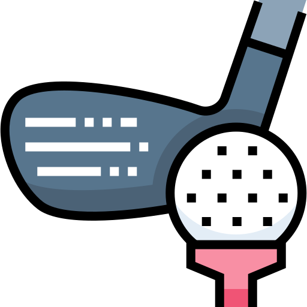

[![Issues][issues-shield]][issues-url]

<!-- PROJECT LOGO -->
<br />
<p align="center">
  <a href="https://github.com/ashikka/golf-it">
    
  </a>

  <b><h2 align="center">Golf it!</h2></b>

  <p align="center">
    Golf it! is a game designed to let you show off your code-fu by solving problems <br> in the least number of <b>characters/</b>
    <br />
    <a href="https://github.com/ashikka/golf-it"><strong>Explore the docs »</strong></a>
    <br />
    <br />
    <a href="https://github.com/ashikka/golf-it">View Demo</a>
    ·
    <a href="https://github.com/ashikka/golf-it/issues">Report Bug</a>
    ·
    <a href="https://github.com/ashikka/golf-it/issues">Request Feature</a>
  </p>
</p>


<!-- TABLE OF CONTENTS -->
## Table of Contents

* [About the Project](#about-the-project)
  * [Built With](#built-with)
* [Getting Started](#getting-started)
  * [Prerequisites](#prerequisites)
  * [Installation](#installation)
* [Usage](#usage)
* [Roadmap](#roadmap)
* [Contributing](#contributing)
* [License](#license)
* [Contributors](#contributors-)


<!-- ABOUT THE PROJECT -->
## About The Project

[![Product Name Screen Shot][product-screenshot]](https://example.com)

Here's a blank template to get started:
**To avoid retyping too much info. Do a search and replace with your text editor for the following:**
`Template`


### Built With

#### 1. Backend
* [Typescript](https://www.typescriptlang.org/download)
* [express](https://www.npmjs.com/package/express)
* [firebase](https://www.npmjs.com/package/firebase)
* [code-executor](https://www.npmjs.com/package/code-executor?activeTab=readme)
* [socket.io](https://www.npmjs.com/package/socket.io)
* [joi](https://www.npmjs.com/package/socket.io)
* [socket.io](https://www.npmjs.com/package/socket.io)
* [redis]()

#### 2. Frontend

* [axios](https://www.npmjs.com/package/axios)
* [Javascript](https://www.javascript.com/)
* [React](https://reactjs.org/)
* [react-bootstrap](https://react-bootstrap.github.io/)
* [react-ace](https://www.npmjs.com/package/react-ace)
* [sass](https://www.npmjs.com/package/sass)
* [react-redux](https://react-redux.js.org/)
* [socket.io-client](https://www.npmjs.com/package/socket.io-client)
* [swal](https://www.npmjs.com/package/sweetalert)
* [react-router-dom](https://www.npmjs.com/package/react-router-dom)
* [react-tilt](https://www.npmjs.com/package/react-tilt)


<!-- GETTING STARTED -->
## Getting Started

To get a local copy up and running follow these simple steps.

### Prerequisites

This is an example of how to list things you need to use the software and how to install them.
* yarn
```sh
npm install -g yarn
```

### Installation
 
1. Clone the repo
```sh
git clone https://github.com/ashikka/golf-it.git
```
2. Install yarn packages
```sh
yarn
```
3. Add necessary environment variables to the project using: 
```sh
{
        echo 'API_KEY='
        echo 'AUTH_DOMAIN='
        echo 'PROJECT_ID='
        echo 'STORAGE_BUCKET='
        echo 'MESSAGING_SENDER_ID='
        echo 'APP_ID='

} >> .env
```
<!-- USAGE EXAMPLES -->
## Usage

Start the project locally by following these steps. 

1. Run a Redis broker on your system

```sh
docker run -p6379:6379 redis
```

2. Start the worker which is going to interact with the library `code-executor`.
```sh
cd backend

ts-node worker.ts
```
3. Start the backend using:
```sh 
yarn run dev
```
4. Start the frontend using:
```sh
cd frontend

yarn start
```
## Routes
The backend of the project supports the following routes: 

### 1. Code submission
```http
POST /code/submission/:questionName
```

| Parameter | Type     | Description                     |
| :--------: | :-------: | :------------------------------: |
| `params`    | `string` | questionName |
| `body`    | `string` |  language |
| `body`    | `string` | code |
| `body`    | `Date` | submitTime |


### 2. Create new room
```http
POST /room/create
```
| Parameter | Type     | Description                     |
| :--------: | :-------: | :------------------------------: |
| `body`    | `string` | clientId|
| `body`    | `number` |  payload |

### 3. Get room
```http
GET /room/:roomId
```
| Parameter | Type     | Description                     |
| :--------: | :-------: | :------------------------------: |
| `params`    | `string` | roomId|

<!-- ROADMAP -->
## Roadmap

See the [open issues](https://github.com/ashikka/golf-it/issues) for a list of proposed features (and known issues).


<!-- CONTRIBUTING -->
## Contributing

Contributions are what make the open source community such an amazing place to be learn, inspire, and create. Any contributions you make are **greatly appreciated**.

1. Fork the Project
2. Create your Feature Branch (`git checkout -b feature/AmazingFeature`)
3. Commit your Changes (`git commit -m 'feat: Add some AmazingFeature'`)
4. Push to the Branch (`git push -u origin feature/AmazingFeature`)
5. Open a Pull Request

You are requested to follow the contribution guidelines specified in [CONTRIBUTING.md](./CONTRIBUTING.md) while contributing to the project :smile:.

<!-- LICENSE -->
## License

Distributed under the MIT License. See [`LICENSE`](./LICENSE) for more information.


<!-- MARKDOWN LINKS & IMAGES -->
<!-- https://www.markdownguide.org/basic-syntax/#reference-style-links -->
[csivitu-shield]: https://img.shields.io/badge/csivitu-csivitu-blue
[csivitu-url]: https://csivit.com
[issues-shield]: https://img.shields.io/github/issues/csivitu/Template.svg?style=flat-square
[issues-url]: https://github.com/ashikka/golf-it/issues
