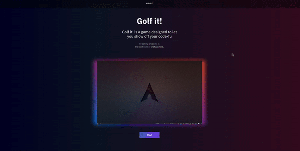

[![Issues][issues-shield]][issues-url]

<!-- PROJECT LOGO -->
<br />
<p align="center">
  <a href="https://github.com/ashikka/golf-it">
    
  </a>

  <b><h2 align="center">Golf it!</h2></b>

  <p align="center">
    Golf it! is a game designed to let you show off your code-fu by solving problems <br> in the least number of <b>characters</b> :sparkles:
    <br />
    <a href="https://github.com/ashikka/golf-it"><strong>Explore the docs »</strong></a>
    <br />
    <br />
    <a href="https://github.com/ashikka/golf-it">View Demo</a>
    ·
    <a href="https://github.com/ashikka/golf-it/issues">Report Bug</a>
    ·
    <a href="https://github.com/ashikka/golf-it/issues">Request Feature</a>
  </p>
</p>


<!-- TABLE OF CONTENTS -->
## :dart: Table of Contents

* [About the Project](#about-the-project)
  * [Built With](#built-with)
* [Getting Started](#getting-started)
  * [Prerequisites](#prerequisites)
  * [Installation](#installation)
* [Usage](#usage)
* [Roadmap](#roadmap)
* [Contributing](#contributing)
* [License](#license)
* [Contributors](#contributors-)


<!-- ABOUT THE PROJECT -->
##  :open_book: About The Project

<p align="center">
  <a href="https://github.com/ashikka/golf-it">
    
  </a>
</p>

One of our teammates loves to solve [codegolf](https://codegolf.stackexchange.com) questions. We thought it would be a good idea to implement this as a one on one competition, where two players can compete live to write the shortest snippet of code to solve a question.

Code Golf refers to attempting to solve a problem using the least amount of characters possible i.e. to have the smallest source code. The term is derived from the sport golf where the player’s goal is to hit their ball in the hole using the least number of shots possible. In Code Golf the developer that solves the problem (usually writing a function) using the fewest number characters possible wins.

## :gear: How we built it

The backend was built using `NodeJS` and `Typescript`. We used `expressJS` to implement all the routes required for submitting code. The backend uses an npm library called `code-executor` which was built in the past by one of our teammates, to execute code against test cases in isolated `Docker` containers. To implement real-time communication when a head-to-head game started, we used `socket.io` to connect both the players in the same room. We used firestore as a database.

The frontend was built using React and Bootstrap. We used `socket.io-client` to interact with the socket server, and axios to interact with the express backend. To display the code editor on the website with multiple themes and syntax support for languages, we used a library called `react-ace`.

## :rocket: What's next for Golf-it!
We have many features planned for golf-it in the future:

* Global leaderboards across the website, for players who regularly win more and more head-to-head games to showcase their skills.
* User accounts (registering and logging in)
* The ability for users to submit their own questions, and people to vote for questions they found interesting.
* Picking avatars for your own profile
* Having live competitions with even more people, instead of just head-to-head ones.

### Built With


| Backend | Frontend     | 
| :--------: | :-------: | 
| [Typescript](https://www.typescriptlang.org/download)    | [Javascript](https://www.javascript.com/) | 
| [express](https://www.npmjs.com/package/express)   | [axios](https://www.npmjs.com/package/axios) |  
|[firebase](https://www.npmjs.com/package/firebase)   | [React](https://reactjs.org/) |
| [code-executor](https://www.npmjs.com/package/code-executor?activeTab=readme)   | [react-redux](https://react-redux.js.org/) |
|   [socket.io](https://www.npmjs.com/package/socket.io)  |  [socket.io-client](https://www.npmjs.com/package/socket.io-client)| 
| [joi](https://www.npmjs.com/package/socket.io)   | [react-router-dom](https://www.npmjs.com/package/react-router-dom) | 
|  [redis](https://redis.io) | [react-ace](https://www.npmjs.com/package/react-ace) | 


<!-- GETTING STARTED -->
## :airplane: Getting Started

To get a local copy up and running follow these simple steps.

### Prerequisites

This is an example of how to list things you need to use the software and how to install them.
* yarn
```sh
npm install -g yarn
```

### Installation
 
1. Clone the repo
```sh
git clone https://github.com/ashikka/golf-it.git
```
2. Install yarn packages
```sh
yarn
```
3. Add necessary environment variables to the project using: 
```sh
{
        echo 'API_KEY='
        echo 'AUTH_DOMAIN='
        echo 'PROJECT_ID='
        echo 'STORAGE_BUCKET='
        echo 'MESSAGING_SENDER_ID='
        echo 'APP_ID='

} >> .env
```
<!-- USAGE EXAMPLES -->
## Usage

Start the project locally by following these steps. 

1. Run a Redis broker on your system

```sh
docker run -p6379:6379 redis
```

2. Start the worker which is going to interact with the library `code-executor`.
```sh
cd backend

ts-node worker.ts
```
3. Start the backend using:
```sh 
yarn run dev
```
4. Start the frontend using:
```sh
cd frontend

yarn start
```
## :triangular_flag_on_post: Routes
The backend of the project supports the following routes: 

### 1. Code submission
```http
POST /code/submission/:questionName
```

| Parameter | Type     | Description                     |
| :--------: | :-------: | :------------------------------: |
| `params`    | `string` | questionName |
| `body`    | `string` |  language |
| `body`    | `string` | code |
| `body`    | `Date` | submitTime |


### 2. Create new room
```http
POST /room/create
```
| Parameter | Type     | Description                     |
| :--------: | :-------: | :------------------------------: |
| `body`    | `string` | clientId|
| `body`    | `number` |  payload |

### 3. Get room
```http
GET /room/:roomId
```
| Parameter | Type     | Description                     |
| :--------: | :-------: | :------------------------------: |
| `params`    | `string` | roomId|

<!-- ROADMAP -->
## :world_map: Roadmap

See the [open issues](https://github.com/ashikka/golf-it/issues) for a list of proposed features (and known issues).


<!-- CONTRIBUTING -->
## :mechanical_arm: Contributing

Contributions are what make the open source community such an amazing place to be learn, inspire, and create. Any contributions you make are **greatly appreciated**.

1. Fork the Project
2. Create your Feature Branch (`git checkout -b feature/AmazingFeature`)
3. Commit your Changes (`git commit -m 'feat: Add some AmazingFeature'`)
4. Push to the Branch (`git push -u origin feature/AmazingFeature`)
5. Open a Pull Request

You are requested to follow the contribution guidelines specified in [CONTRIBUTING.md](./CONTRIBUTING.md) while contributing to the project :smile:.

<!-- LICENSE -->
##  :page_facing_up: License

Distributed under the MIT License. See [`LICENSE`](./LICENSE) for more information.


<!-- MARKDOWN LINKS & IMAGES -->
<!-- https://www.markdownguide.org/basic-syntax/#reference-style-links -->
[csivitu-shield]: https://img.shields.io/badge/csivitu-csivitu-blue
[csivitu-url]: https://csivit.com
[issues-shield]: https://img.shields.io/github/issues/csivitu/Template.svg?style=flat-square
[issues-url]: https://github.com/ashikka/golf-it/issues
